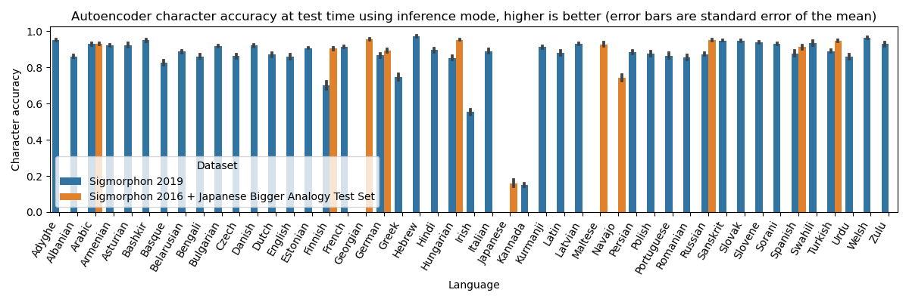
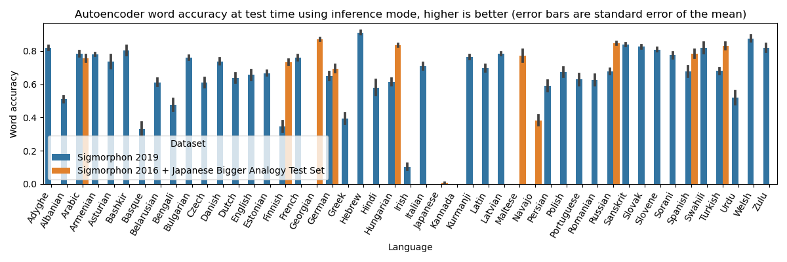
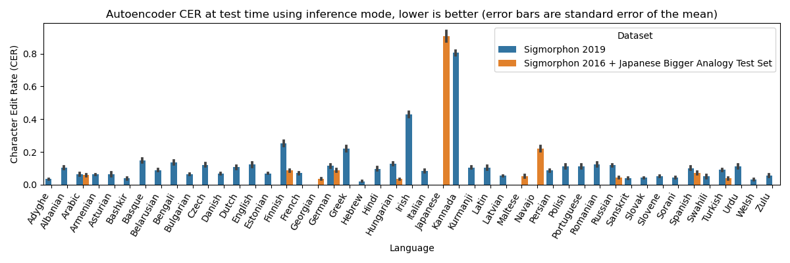
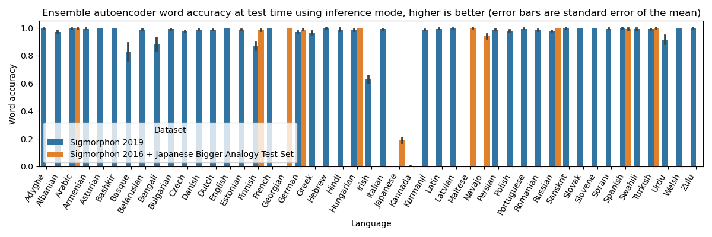
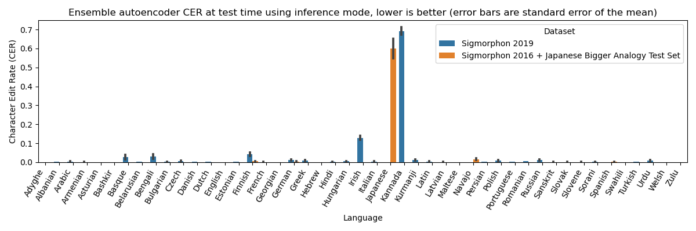

# GenMorpho
GenMorpho stands for  **Gen**erative Autoencoder Neural Network for word **Morpho**logy.
The approach presented here is a reproduction of the one described in the article "Solving Morphological Analogies Through Generation" (Kevin Chan, Shane Peter Kaszefski-Yaschuk, Camille Saran, Esteban Marquer, Miguel Couceiro, 2022).

Note that due to a change in the coding environment and recommended parameter since the publication, the results, performance and training time of the model differ from what is reported in "Solving Morphological Analogies Through Generation".

To cite this repository, use the reference of the original article:
```bib
@inproceedings{chan:hal-03674913,
  TITLE = {{Solving Morphological Analogies Through Generation}},
  AUTHOR = {Chan, Kevin and Kaszefski-Yaschuk, Shane Peter and Saran, Camille and Marquer, Esteban and Couceiro, Miguel},
  URL = {https://hal.inria.fr/hal-03674913},
  BOOKTITLE = {{IJCAI-ECAI Workshop on the Interactions between Analogical Reasoning and Machine Learning (IARML@IJCAI-ECAI 2022)}},
  ADDRESS = {Vienna, Austria},
  ORGANIZATION = {{Miguel Couceiro and Pierre-Alexandre Murena}},
  SERIES = {Proceedings of the IJCAI-ECAI Workshop on the Interactions between Analogical Reasoning and Machine Learning (IARML@IJCAI-ECAI 2022)},
  VOLUME = {3174},
  PAGES = {29-39},
  YEAR = {2022},
  MONTH = Jul,
  KEYWORDS = {Analogy solving ; Representation learning ; Word generation ; Morphological analogy},
  PDF = {https://hal.inria.fr/hal-03674913/file/IARML_IJCAI22_GenMorpho.pdf},
  HAL_ID = {hal-03674913},
  HAL_VERSION = {v1},
}

```

## Table of Contents

- [Table of Contents](#table-of-contents)
- [GenMorpho model](#genmorpho-model)
  - [Model architecture](#model-architecture)
  - [Model files](#model-files)
  - [Hyperparameters and training parameters](#hyperparameters-and-training-parameters)
  - [Performance of the models](#performance-of-the-models)
  - [Performance of the ensemble models](#performance-of-the-ensemble-models)
- [Install Instructions](#install-instructions)
  - [Cloning the Repository](#cloning-the-repository)
  - [Installing the Dependencies](#installing-the-dependencies)
    - [Anaconda](#anaconda)
  - [Setting up the data (Sigmorphon2016 and Sigmorphon2019)](#setting-up-the-data-sigmorphon2016-and-sigmorphon2019)
    - [Setting-Up the Japanese Data for Sigmorphon2016](#setting-up-the-japanese-data-for-sigmorphon2016)
- [General Usage](#general-usage)
  - [Output of the training script in the terminal](#output-of-the-training-script-in-the-terminal)
- [Using the pretrained models](#using-the-pretrained-models)
  - [`load_pytorch`](#load_pytorch)
  - [`load_lightning`](#load_lightning)

## GenMorpho model
### Model architecture
Please see "Solving Morphological Analogies Through Generation" (Kevin Chan, Shane Peter Kaszefski-Yaschuk, Camille Saran, Esteban Marquer, Miguel Couceiro, 2022) for details.

### Model files
Currently, we do not chare the picked files of the models (50 models per language for each language is close to 8 GiB)

### Hyperparameters and training parameters
Miscellaneous information about the training hyperparameters, which have the name of the arguments in the training script:
| Hyperparameter | Default value | Description |
|----------------|-------|-------------|
| `emb_size`      | 256   | The size of the word embedding. Each hidden state and cell state of the encoder BiLSTM is 1/4 of that number, and each hidden state and cell state of the decoder LSTM is 1/2 of that number. |
| `char_emb_size` | 0     | If non-zero, the usual one-hot encoding of characters is replaced by a character embedding of size `char_emb_size`. Usually decreases performance, somehow. |
| `max_epochs`    | 100  | The maximum number of epochs. This value is corrected based on `nb_word_train` and the actual size of the training dataset. |
| `nb_word_train` | 40000 | The maximum number of words to use in the training set. If there is not enough words to create the training set, the number of training epochs is increased to have a comparable number of training step. |
| `nb_word_val`   | 500   | The number of words in the validation set (the set used for early stopping and determine the best model to save). |
| `nb_word_test`  | 500   | The number of words in the test set (the set used after training to measure model performance). |
| `batch_size`    | 2048  | The number of words per training batch. |

Some training hyperparameters that do not correspond to arguments:
| Hyperparameter | Value | Description |
|----------------|-------|-------------|
| Learning rate  | 1e-2  | The learning rate of the model. |
| Optimizer | NAdam | The optimization algorithm. This variant of Adam empirically gave us better and faster convergence in our design experiments. See [NAdam on PyTorch](https://pytorch.org/docs/stable/generated/torch.optim.NAdam.html) for details. |
| `num_workers` | 4 | The number of parallel workers for the dataloader. |
| Early stopping patience | 6 | The number of training epochs for which, if no improvement in the validation loss is observed, the training stops. |
| Stochastic Weight Averaging learning rate | 1e-2 | We use the [StochasticWeightAveraging](https://pytorch-lightning.readthedocs.io/en/stable/api/pytorch_lightning.callbacks.StochasticWeightAveraging.html) to improve the model performance and generalization. See the link for details. |

Four hyperparameters separate the models from each other:
- `dataset` and `language`: the identifiers of the language data the model is trained on;
- `model_seed_id`: the index of the random seed used to initialize the model, but sadly, due to Cross Entropy being non-deterministic in the current CUDA/PyTorch implementation, this hyperparameters does not guarantee reproducible results;
- `data_seed_id`: the index of the random seed used to split the vocabulary, it should be enough to maintain a reproducible data splits between runs (but still no reproducible results, sadly).

### Performance of the models




How to interpret the results?
- If the word accuracy is high, then the model predicts correctly most of the unseen words, without any error.
<!-- - If the character accuracy is high, then the model has small mistakes for a lot of words.
- If the character accuracy is low but the CER is low, than most of the mistakes the model makes can be solved with deletion or insertion of characters.
- If the the character accuracy is low and the CER high, then the model does not perform well at all (ex: Irish, Japanese, Kanada, Navajo, Greek, or Finnish its 2019 version). -->
- If the CER is low, then most of the mistakes the model makes can be solved with deletion or insertion of characters.
- If the CER is high, then the model does not perform well at all (ex: Irish, Japanese, Kanada, Navajo, Greek, or Finnish its 2019 version).

### Performance of the ensemble models



The 

## Install Instructions
The following installation instruction are designed for command line on Unix systems. Refer to the instructions for Git and Anaconda on your exploitation system for the corresponding instructions.

### Cloning the Repository
Clone the repository on your local machine, using the following command:

```bash
git clone https://github.com/EMarquer/genmorpho.git
git submodule update --init siganalogies
```

### Installing the Dependencies
The code was designed using Python 3.10.4, PyTorch 1.12.1, and PyTorch Lightning 1.7.6, and was not tested with other versions. However, it should work with any Python 3.7 or greater.
We recommend using Anaconda to isolate your coding environment, avoid conflict, and make package installation easier. THis is especially relevant when using quickly changing tools like PyTorch.

#### Anaconda
1.  Install [Anaconda](https://www.anaconda.com/) (or miniconda to save storage space).
2.  Then, create a conda environement (for example `morpho-analogy`) and install the dependencies, using the following commands:
    ```bash
    conda create --name morpho-analogy python=3.9 -f environment.yml
    conda install --name morpho-analogy numpy ninja pyyaml mkl mkl-include setuptools cmake cffi typing_extensions future six dataclasses
    ```
3.  Use one of the following, depending on whether you have a GPU with CUDA available:
    ```bash
    # cuda 11.3
    conda install -y --name morpho-analogy pytorch cudatoolkit=11.3 -c pytorch
    # cuda 11.6
    conda install -y --name morpho-analogy pytorch cudatoolkit=11.6 -c pytorch -c conda-forge
    # cpu
    conda install -y --name morpho-analogy pytorch cpuonly -c pytorch
    ```
    These instruction correspond to PyTorch 1.12.1 in September 2022. See [https://pytorch.org/](https://pytorch.org/) for up to date install instructions.
4.  Finally, install the other required libraries:
    ```bash
    # extra conda libs
    conda install -y --name morpho-analogy -c conda-forge pytorch-lightning torchmetrics pandas "seaborn>=0.12" scikit-learn tabulate
    ```
5.  All the following commands assume that you have activated the environment you just created. This can be done with the following command (using our example `morpho-analogy`)
    ```bash
    conda activate morpho-analogy
    ```

### Setting up the data (Sigmorphon2016 and Sigmorphon2019)
To install the Siganalogies data, run at the root of the repository:
- `git submodule update --init sigmorphon2016` for Sigmorphon 2016;
- `git submodule update --init sigmorphon2019` for Sigmorphon 2019.

#### Setting-Up the Japanese Data for Sigmorphon2016
The Japanese data is stored as a Sigmorphon2016-style data file `japanese-task1-train` at the root of the directory, and should be moved to `sigmorphon2016/data`, the Sigmorphon2016 data folder. This can be done by running the following command:

```bash
cp siganalogies/japanese-task1-train sigmorphon2016/data/
```

There is no test nor development set. For the training and evaluation, the file `japanese-task1-train` is split: 70\% of the analogies for the training and 30\% for the evaluation. The split is always the same for reproducibility, using random seed 42.

The Japanese data was extracted from the original [Japanese Bigger Analogy Test Set](https://vecto-data.s3-us-west-1.amazonaws.com/JBATS.zip).

## General Usage
To use the pretrained models for each language in Siganalogies, see [Using the pretrained models](#using-the-pretrained-models).
To train the models on all the languages of Siganalogies (excluding low-ressource languages and Uzbek), use the `python train_all_autoencoders.py` script.
To train a single model on Siganalogies, use the `python train_autoencoder.py` script. Refer to `python train_autoencoder.py --help` for details.

### Output of the training script in the terminal
The terminal output of the scripts `python train_autoencoder.py` and `python train_all_autoencoders.py` correspond to the PyTorch Lightning outputs.
The summary table at the end of the evaluation contains 7 values:
- `test_loss`: the CrossEntropyLoss on the test set;
- teacher forcing metrics, describing the performance of the model when applying teacher forcing [Wikipedia link](https://en.wikipedia.org/wiki/Teacher_forcing):
    - `tf_word_accuracy`: the percentage of words the models manages to predict correctly, from the first letter to the end-of-sequence character (included);
    - `tf_char_accuracy`: the percentage of characters the models manages to predict correctly, from the first letter to the end-of-sequence character (included);
    - `tf_cer`: the average [Character Error Rate](https://torchmetrics.readthedocs.io/en/v0.8.2/text/char_error_rate.html), from the first letter to the end-of-sequence character (included);
- max-value generation metrics, describing the performance of the model when generating character by character, selecting only the most likely character at each time-step:
    - `gen_max_word_accuracy`: the percentage of words the models manages to predict correctly, from the first letter to the end-of-sequence character (included);
    - `gen_max_char_accuracy`: the percentage of characters the models manages to predict correctly, from the first letter to the end-of-sequence character (included);
    - `gen_max_cer`: the average [Character Error Rate](https://torchmetrics.readthedocs.io/en/v0.8.2/text/char_error_rate.html), from the first letter to the end-of-sequence character (included);
- sampling generation metric, describing the performance of the model when generating character by character, sampling the characters from the predicted distribution at each time-step:
    - `gen_rand_word_accuracy`: the percentage of words the models manages to predict correctly, from the first letter to the end-of-sequence character (included);
    - `gen_rand_char_accuracy`: the percentage of characters the models manages to predict correctly, from the first letter to the end-of-sequence character (included);
    - `gen_rand_cer`: the average [Character Error Rate](https://torchmetrics.readthedocs.io/en/v0.8.2/text/char_error_rate.html), from the first letter to the end-of-sequence character (included);

At the end of the training, a few examples are printed in the terminal.
They contain the input string fed to the model, what we expect the model to generate, and the decoded result of the two kinds of generations mentioned above.
Specials characters are: `<` the beginning-of-sequence character, `>` the end-of-sequence character, and `_` the padding character.

You should also expect a few PyTorch Lightning warnings and a warning about reproducibility.

## Using the pretrained models
Once the embedding model is trained, you can load it by using the `load_pytorch` and `load_lightning` functions in `utils/autoload.py`.
The parameters are the following:
- `dataset` and `language`: the identifiers of the language data the model is trained on;
- `model_seed_id`: the index of the random seed used to initialize the model, but sadly, due to Cross Entropy being non-deterministic in the current CUDA/PyTorch implementation, this hyperparameters does not guarantee reproducible results;
- `data_seed_id`: the index of the random seed used to split the vocabulary, it should be enough to maintain a reproducible data splits between runs (but still no reproducible results, sadly).

### `load_pytorch`
> The `load_pytorch` function **does not require PyTorch Lightning to be installed** to work.

This function will give you the PyTorch model (`ae` in the example below) corresponding to the input parameters, as well as the corresponding `siganalogies.CharEncoder` (`char_encoder` in the example below) necessary to encode words in the way the model is used to.

The encoder and decoder networks are accessible as `ae.encoder` and `ae.decoder`.

Example of a typical workflow:
```python
>>> from utils.autoload import load_pytorch
>>> from utils.data import collate_words
>>> ae, char_encoder = load_pytorch(dataset="2019", language="english", model_seed_id=0, data_seed_id=0)
>>> word = "word"
>>> encoded_word = char_encoder.encode(word)
>>> encoded_word = collate_words([encoded_word],
... bos_id = char_encoder.BOS_ID,
... eos_id = char_encoder.EOS_ID,
... pad_id= char_encoder.PAD_ID)
>>> embedding = ae.encoder(encoded_word)
>>> generated = ae.decoder.generate(embedding,
... initial_character=char_encoder.BOS_ID,
... stop_character=char_encoder.EOS_ID,
... pad_character=char_encoder.PAD_ID,
... max_size=64,
... sample=False)
>>> char_encoder.decode(generated)
['word>']
>>> char_encoder.decode(generated, eos_char="]", bos_char="[")
['word]']
>>> char_encoder.decode(generated, pad_char="", eos_char="", bos_char="")[0]
'word'
```

### `load_lightning`
> The `load_lightning` function **requires PyTorch Lightning to be installed** to work.
> 
This function will give you the PyTorch Lightning module (`lightning_model` in the example below) corresponding to the input parameters.
This still gives you access to the model using `lightning_model.ae`, but also directly contains the `siganalogies.CharEncoder` as `lightning_model.encoder`.
`lightning_model` provides useful functions like `load_lightning(...).example(batch)` to generate examples of what the model produces when getting a specific input it is still necessary to provide the encoded character.

The encoder and decoder networks are accessible as `ae.encoder` and `ae.decoder`.

Example of a typical workflow:
```python
>>> from utils.autoload import load_lightning
>>> from utils.data import collate_words
>>> lightning_model = load_lightning(dataset="2019", language="english", model_seed_id=0, data_seed_id=0)
>>> word = "word"
>>> encoded_word = lightning_model.encoder.encode(word)
>>> encoded_word = collate_words([encoded_word],
... bos_id = lightning_model.encoder.BOS_ID,
... eos_id = lightning_model.encoder.EOS_ID,
... pad_id= lightning_model.encoder.PAD_ID)
>>> embedding = lightning_model.ae.encoder(encoded_word)
>>> generated = lightning_model.ae.decoder.generate(embedding,
... initial_character=lightning_model.encoder.BOS_ID,
... stop_character=lightning_model.encoder.EOS_ID,
... pad_character=lightning_model.encoder.PAD_ID,
... max_size=64,
... sample=False)
>>> lightning_model.encoder.decode(generated)
['word>']
>>> lightning_model.encoder.decode(generated, eos_char="]", bos_char="[")
['word]']
>>> lightning_model.encoder.decode(generated, pad_char="", eos_char="", bos_char="")[0]
'word'
```